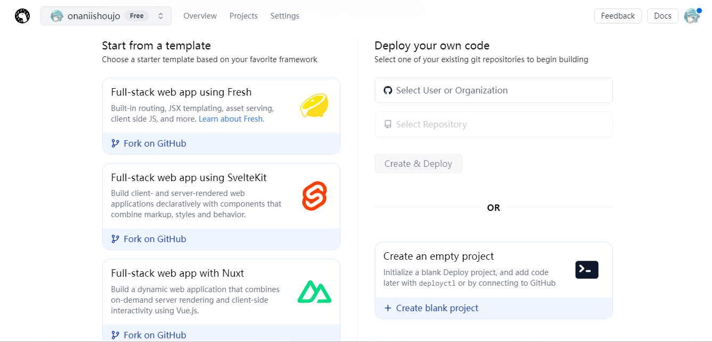

## 搭建Hexo博客

默认分配一个`project_name.deno.dev`域名，速度还可以

类似Cloudflare Pages

需要准备一个GitHub账号，使用GitHub登陆[Deno](https://dash.deno.com/signin)

1. Deno Deploy中新建一个`Project`，选择`Create an empty project`

   如果找不到`Create an empty project`，这里有链接：[New Project - Deploy (deno.com)](https://dash.deno.com/new)

   

2. 在博客的GitHub仓库中新建一个workflow，内容如下：

   ``` yaml
   name: Deploy
   on:
     workflow_dispatch:
     push:
       branches: gh-pages  # 根据需要设置触发条件
   
   jobs:
     deploy:
       name: Deploy
       runs-on: ubuntu-latest
   
       steps:
         - name: Clone repository
           uses: actions/checkout@v4
           with: 
             ref: 'gh-pages'  # 根据需要修改为你的分支名
   
         - name: Install Deno
           uses: denoland/setup-deno@v1
           with:
             deno-version: v1.x
   
         - name: Install deployctl
           run: "deno install --allow-all --no-check -r -f https://deno.land/x/deploy/deployctl.ts"
   
         - name: Upload to Deno Deploy
           env: 
             DENO_TOKEN: ${{ secrets.DENO_TOKEN }}  # 使用设置的secrets名
           run: "DENO_DEPLOY_TOKEN=$DENO_TOKEN deployctl deploy --prod --project=<project_name> https://deno.land/std@0.208.0/http/file_server.ts"  # 将<project_name>替换为你在Deno新建的项目名
   ```

3. 在[https://dash.deno.com/account#access-tokens](https://dash.deno.com/account#access-tokens)生成一个Access Token，添加进博客GitHub仓库的secrets中，名字可以用上面的`DENO_TOKEN`（也可以用别的名字）

## 访问量统计

使用Deno KV实现了一个类似不蒜子计数的功能

### Deno Deploy端的配置

需要确保Deno KV中已经有`user`和`new`两组数据，没有可以先创建出来

新建一个Playground，代码如下（请替换`url_set`的内容）

```ts
import { Hash, encode } from "https://deno.land/x/checksum@1.2.0/mod.ts";
const kv = await Deno.openKv();
const url_set = ['这里替换为该Deploy项目的地址', '后面这几个是你的网站地址(可以只填一个)', '', '']

Deno.serve(async (request: Request, info: Deno.ServeHandlerInfo) => {
  if (request.url != url_set[0]+'/' && request.url != url_set[0]) {
    return new Response('403 Forbidden',{status: 403});
  }
  var flag;
  for (const pair of request.headers.entries()) {
    if (pair[0] == 'referer') {
      for (const url of url_set) {
        if (pair[1].includes(url)) {
          var h = new Headers();
          h.append('Access-Control-Allow-Origin', url);
          flag = true;
          break;
        }
      }
    }
  }
  if (!flag) {
    return new Response('403 Forbidden',{status: 403});
  }

  await kv.atomic().sum(["visitors"], 1n).commit();
  const count = await kv.get(["visitors"]);

  const ip = info.remoteAddr.hostname;
  const ip_md5 = new Hash("md5").digest(encode(ip)).hex();

  const user_array = await kv.get(["user"]);
  if (user_array.value.indexOf(ip_md5) == -1) {
    const ex_array = user_array.value.concat(ip_md5)
    await kv.set(["user"], ex_array)
    await kv.atomic().sum(["new"], 1n).commit();
  }
  const pv = await kv.get(["new"]);

  const result = `\{"uv": ${count.value}, "pv":${pv.value}\}`;
  return new Response(result, {headers: h});
});
```

### 前端的配置

html部分：

```html
总访客<span id="counter_uv"></span>人
总访问量<span id="counter_pv"></span>次
```

js部分：

```javascript
fetch('url') // 将url设置为你的Deno Deploy地址
    .then(response => {
        return response.json()
    })
    .then(data => {
        document.getElementById('counter_uv').innerHTML = data.uv
        document.getElementById('counter_pv').innerHTML = data.pv
    })
```

## Artitalk_SafeMode
[Artitalk](https://artitalk.js.org/)自带SafeMode，但是需要使用Cloudflare Workers，在某些地区不方便使用

本人修改了原版的Workers脚本，并将其移植到了Deno Deploy

需要设置的环境变量：

`APPID`: 字符串

 `APPKEY`: 字符串

`SERVERDOMAIN`: 当前Deno Deploy的域名，不带`https://`头

`ATCOMMENT`: true或false

`CORS`: url1,url2,url3 (url之间用半角逗号隔开 且没有空格)

修改后的脚本如下

``` typescript
async function handleRequest(request: Request): Promise<Response> {
    const AppId: string = Deno.env.get('APPID')
    const AppKey: string = Deno.env.get('APPKEY')
    const ServerDomain: string = Deno.env.get('SERVERDOMAIN')
    const atComment: Boolean = Deno.env.get('ATCOMMENT') == 'true'
    const CORS: string[] = Deno.env.get('CORS').split(',')

    const url: URL = new URL(request.url)
    const urlObj: URL = new URL(url)
    const path: string = urlObj.href.substr(urlObj.origin.length)
    const classac: string = l(rp(path).split('/'))

    if (AppId == "" || AppKey == "") { return new Response('Artitalk-Safe异常: 您没有设定appid和appkey') }
    if (classac == "atComment" && !atComment) { return new Response('{"code":101,"error":"Artitalk-Safe: 评论功能未开启"}', { headers: { "content-type": "application/json;charset=utf-8" } }) }
    if (classac == "_File" || classac == "_Followee" || classac == "_Follower" || classac == "_Installation" || classac == "_Role") { return new Response('{"code":101,"error":"Artitalk-Safe: 操作是禁止的"}', { headers: { "content-type": "application/json;charset=utf-8" } }) }

    url.hostname = ServerDomain
    const reqHEDNew: Headers = new Headers(request.headers)
    if (reqHEDNew.get("X-LC-Id")) {
        reqHEDNew.set("X-LC-Id", AppId)
        reqHEDNew.set("X-LC-Key", AppKey)
    }
    if (reqHEDNew.get("x-lc-sign")) {
        reqHEDNew.delete("X-LC-Sign")
    }
    const reqNew: Request = new Request(request, { headers: reqHEDNew })
    const responsefetch: Response = await fetch(url.toString(), reqNew)
    const resHEDNew: Headers = new Headers(responsefetch.headers)
    
    var flag: Boolean = false
    for (let pair of request.headers.entries()) {
        if (pair[0] == 'referer') {
            for (let url of CORS) {
                if (pair[1].indexOf(url) != -1) {
                    resHEDNew.set("Access-Control-Allow-Origin", url.slice(0, -1))
                    flag = true
                    break
                }
            } break
        }
    }

    if (!flag){
        resHEDNew.delete("Access-Control-Allow-Origin")
    }

    const response: Response = new Response(responsefetch.body, { headers: resHEDNew })
    return response
}

function rp(p: string): string {
    return p.split("?")[0]
}

function l(p: string[]): string {
    return p[getJsonLength(p) - 1]
}

function getJsonLength(jsonData: string[]): number {
    var jsonLength = 0
    for (var _ in jsonData) {
        jsonLength++
    }
    return jsonLength
}

Deno.serve((req: Request) => {
    return handleRequest(req)
});
```
