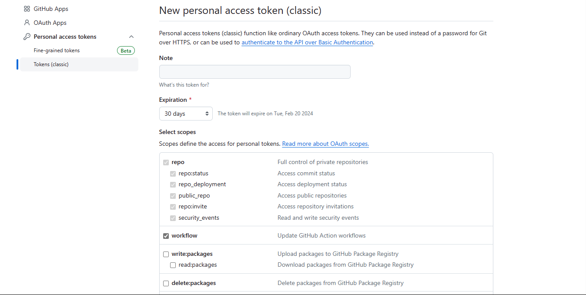
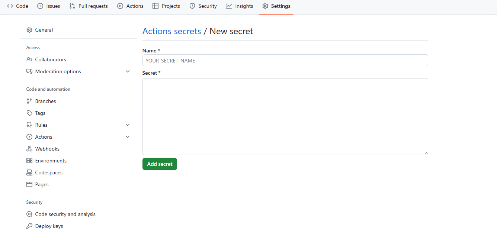

> 现在网站用了六套主题，周一用Diaspora，周二和周日用ShokaX，周三和周六用Particlex，周四用Stellaris，周五用Fluid，里站用Brewski，可喜可贺

使用`Github Actions`实现每天自动切换网站的主题

比如周一、三、五、七使用`theme-A`，二、四、六使用`theme-B`

当然也可以添加`theme-C`、`theme-D`...


1. 在`用户名.github.io`仓库中有两个文件夹`theme-A/`和`theme-B/`，用于存放两套主题的静态文件

2. 在GitHub的 Settings -> Developer Settings -> Personal access tokens -> Tokens (classic) ([链接](https://github.com/settings/tokens/new))生成一个token，填写Note，勾选`repo`和`workflow`然后生成

   

3. 在仓库的 Settings -> Secrets and variables -> Actions 添加刚才的token

   

4. 在GitHub仓库中新建`.github/workflows`，新建一个`.yaml`文件，文件名随意；可以先点`Run workflow`把静态文件部署到`gh-pages`分支

```yaml
name: Update Blog

on:
  workflow_dispatch:
  schedule:
    - cron: "0 2 * * *"

jobs:
  update:
    runs-on: ubuntu-latest
    steps:
      - name: Checkout code
        uses: actions/checkout@v4

      - name: Determine Deployment Directory
        id: determine_directory
        run: |
          day_of_week=$(date +'%u')
          if [ $((day_of_week % 2)) -eq 0 ]; then
          echo "::set-output name=directory::theme-B/"
            else
          echo "::set-output name=directory::theme-A/"
          fi
          
      - name: Get Current Time
        id: current_time
        run: echo "::set-output name=time::$(date +'%Y-%m-%d %H:%M:%S')"

      - name: Deploy
        uses: peaceiris/actions-gh-pages@v3.9.3 # 使用部署到 GitHub pages 的 action
        with:
          publish_dir: ${{ steps.determine_directory.outputs.directory }} 
          github_token: ${{ secrets.DEPLOY_SECRET }} # secret 名
          user_name: ${{ secrets.MY_USER_NAME }}
          user_email: ${{ secrets.MY_USER_EMAIL }}
          commit_message: "Automated Deployment at ${{ steps.current_time.outputs.time }}" # 在 commit message 中添加当前时间
```

5. 在仓库的 Settings -> Pages 设置`Build and deployment`的`Source`为`Deploy from a branch`，选择`gh-pages`分支，此时GitHub Pages将开始部署


~~总之就挺神经病的~~

~~写的方法我自己都看不懂~~

~~感谢ChatGPT提供的GitHub Actions的源码~~
